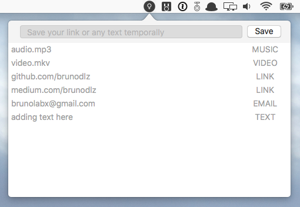

# PasteMenu

Save your link or any text temporally :)

[⬇️ LATEST RELEASE ⬇️](https://github.com/brunodlz/PasteMenu/releases/tag/v0.3)

## Support

Please, don't hesitate to [file an
issue](https://github.com/brunodlz/PasteMenu/issues/new) if you have questions.

## Author

Bruno da Luz. :octocat: [GitHub](https://github.com/brunodlz) :bird: [Twitter](https://twitter.com/brunodlz)

## License

This project is distributed under the [MIT License](https://raw.githubusercontent.com/brunodlz/PasteMenu/master/LICENSE)
